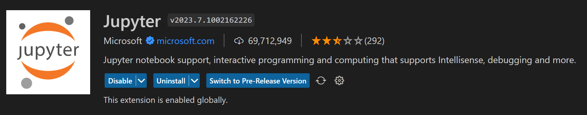

## Install Visual Studio Code

[Visual Studio Code](https://azure.microsoft.com/en-us/products/visual-studio-code/) is an IDE developed by Microsoft which aims you to program in different languages like Python.

You can install VS Code directly from their website with the following link:

[:octicons-desktop-download-24: | Download VS Code](https://code.visualstudio.com/download){:target="_blank" .md-button .md-button--primary}

Hence VS Code installed, you can install the following extensions:

{ width="600" }
{ width="600" }
{ width="600" }

!!! note
    You will need to install Python if you don't already have it. You can also install other extension if you want. Beware of your installation path. You should a avoid any spaces in your folder or to have one drive sync to your VS Code folder.

### Create a Python environment and install/import a new Package

Before you can install any package within your VS Code repository, you will need to create an environment.
There are several ways to create a Python environment (Conda environment, venv through command line). In our case we will create a venv environment through the [VS Code GUI](https://code.visualstudio.com/docs/python/environments#_creating-environments).
Now we can install the package you want to use. In our case, we will install pandas. Pandas is an open-source data analysis and manipulation tool.

```python
pip install pandas
```

Once it is installed, you can import your new package and start to use the pandas' function. Here we have decided to add an alias to the import to avoid writing pandas before each pandas function. We can just use pd.{the pandas function to be used}.

```python
import pandas as pd # as keywords aim to create an alias. It allows you to use the function shortcut instead of the whole name
pd.DataFrame() # Function to transform an array/dict/iterable to a DataFrame type
```

Whenever you need to import only one function from your package you can use from (package} import (function).

```python
from pandas import DataFrame
```

!!! note
    You have several ways to install a Python package:
    Directly from your notebook:

    ```python
    !pip install {package}
    #OR
    %pip install {package}
    ```

    Directly from your terminal (Terminal>New Terminal>Command Prompt or Terminal>New Terminal>Powershell ):

    ```sh
    pip install {package}
    ```

    ??? warning "Troubleshooting"
        If you try to execute some code through Powershell, you may have the error :  *Impossible to load the file Activate. because scripts execution is deactivated on this system.
        Consult about_Execution_Policies through the following [Microsoft documentation](https://go.microsoft.com/fwlink/?  inkID=135170)*.
        You can execute the following Powershell command directly in the terminal:

        ```Powershell
        Set-ExecutionPolicy Unrestricted -Scope Process
        ```

## Create or connect to Github

[GitHub](https://github.com/) is a platform for software development and version control using Git, allowing developers to store and manage their code. Create or connect to a GitHub account, you can either use your BSB mail address or your personnal mail address.

[:octicons-mark-github-16: | GitHub Sign Up](https://github.com/signup?ref_cta=Sign+up&ref_loc=header+logged+out&ref_page=%2F&source=header-home){ :target="_blank" .md-button .md-button--primary}

## Install Github Desktop

[Github Desktop](https://desktop.github.com/) aims to facilitate the use of Github and manage easily your repositories, commits, branches. You can connect to Github Desktop with your GitHub account.

[:octicons-desktop-download-24: | Download Github Desktop](https://desktop.github.com/){ .md-button .md-button--primary :target="_blank" }

## NASDAQ account creation

[NASDAQ Data](https://data.nasdaq.com/) is a source for financial, economic and alternative datasets. It aims to:

- Access API, libraries, and tools
- Download free data and premium sample data in any format
- Access export and visualization tools

[:octicons-number-24: | NASDAQ Sign Up](https://data.nasdaq.com/sign-up){ :target="_blank" .md-button .md-button--primary}
