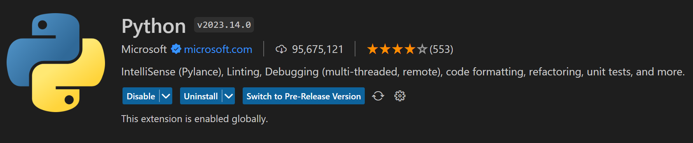
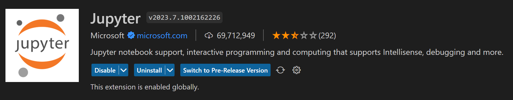

## Install Visual Studio Code

[Visual Studio Code](https://azure.microsoft.com/en-us/products/visual-studio-code/) is an IDE developed by Microsoft that aims to program in different languages like Python.

You can install VS Code directly from their website with the following link:

[:octicons-desktop-download-24: | Download VS Code](https://code.visualstudio.com/download){:target="_blank" .md-button .md-button--primary}

Hence VS Code installed, you can install the following extensions:

{ width="600" }
{ width="600" }
{ width="600" }

!!! note
    You will need to install Python if you don't already have it. You can also install other extensions if you want. Beware of your installation path. You should avoid any spaces in your folder or have one drive sync to your VS Code folder.

### Install/import Packages

When you have complex environment, you may need to install several package at the same time. The file requirements.txt enables you to declare package to install in the same place to install them all.
Create a file 'requirements.txt' and add the following packages:

- pandas
- numpy

Now we can call the file with the following command to install packages declared
    ```Powershell
    pip install -r requirements.txt
    ```

You can also install packages by packages calling pip install.

    ```python
    pip install pandas
    ```

Once it is installed, you can import your new package and start to use the pandas' function. Here we have decided to add an alias to the import to avoid writing pandas before each pandas function. We can just use pd.{the pandas function to be used}.

    ```python
    import pandas as pd # as keywords aim to create an alias. It allows you to use the function shortcut instead of the whole name
    pd.DataFrame() # Function to transform an array/dict/iterable to a DataFrame type
    ```

Whenever you need to import only one function from your package you can use from (package} import (function).

    ```python
    from pandas import DataFrame
    ```

!!! note
    You have several ways to install a Python package:
    Directly from your notebook:

    ```python
    !pip install {package}
    #OR
    %pip install {package}
    ```

    Directly from your terminal (Terminal>New Terminal>Command Prompt or Terminal>New Terminal>Powershell ):

    ```sh
    pip install {package}
    ```

### Create a Python environment

Before you can install any package within your VS Code repository, you will need to create an environment.
There are several ways to create a Python environment (Conda environment, Venv through command line). In our case, we will create a Venv environment through the [VS Code GUI](https://code.visualstudio.com/docs/python/environments#_creating-environments).

    ??? warning "Troubleshooting"
        - If you try to execute some code through Powershell, you may have the error :  *Impossible to load the file Activate. because script execution is deactivated on this system.
        Consult about_Execution_Policies through the following [Microsoft documentation](https://go.microsoft.com/fwlink/?  inkID=135170)*.
        You can execute the following Powershell command directly in the terminal:

        ```Powershell
        Set-ExecutionPolicy Unrestricted -Scope Process
        ```
        - If you are not able to execute command line, you may add quote around your path if it contains special caracters

        ```Powershell
        yourCommand 'yourPath!'
        ```

## Install GIT

Git is a tool that's used to manage multiple versions of source code edits that are then transferred to files in a Git repository.

[Download GIT](https://git-scm.com/downloads){ :target="_blank" .md-button .md-button--primary}

## Create or connect to GitHub

[GitHub](https://github.com/) is a platform for software development and version control using Git, allowing developers to store and manage their code. Create or connect to a GitHub account, you can either use your BSB mail address or your personal mail address.

[:octicons-mark-github-16: | GitHub Sign Up](https://github.com/signup?ref_cta=Sign+up&ref_loc=header+logged+out&ref_page=%2F&source=header-home){ :target="_blank" .md-button .md-button--primary}

## Install Github Desktop

[GitHub Desktop](https://desktop.github.com/) aims to facilitate the use of GitHub and manage easily your repositories, Commits, and Branches. You can connect to GitHub Desktop with your GitHub account.

[:octicons-desktop-download-24: | Download Github Desktop](https://desktop.github.com/){ .md-button .md-button--primary :target="_blank" }

## Alpha Vantage account creation

[Alpha Vantage](https://www.alphavantage.co/) provides real-time and historical financial market data through a set of powerful and developer-friendly data APIs and spreadsheets

!!! Warning
    If you are connected to the School Wifi you may have an error stating that you already have a key. To fix the error, please use your phone or share your phone's Wifi hotspot ("Partage de connexion" in French).

[:octicons-number-24: | Alpha Vantage Sign Up](https://www.alphavantage.co/support/#api-key){ :target="_blank" .md-button .md-button--primary}

---
