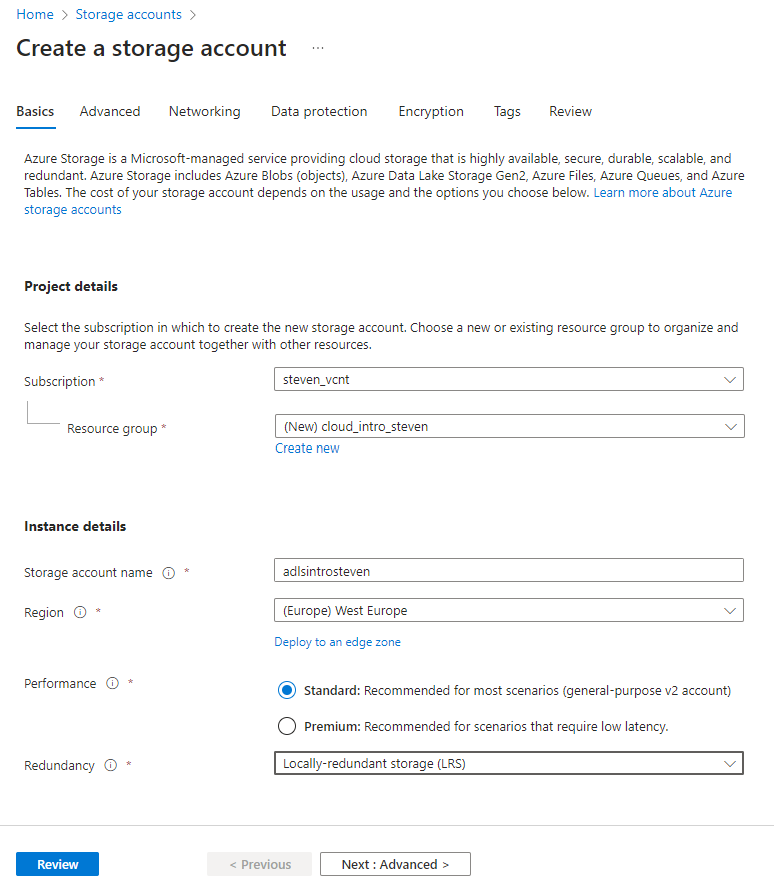
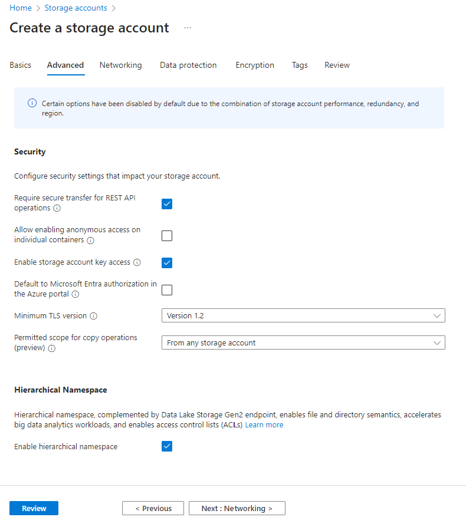
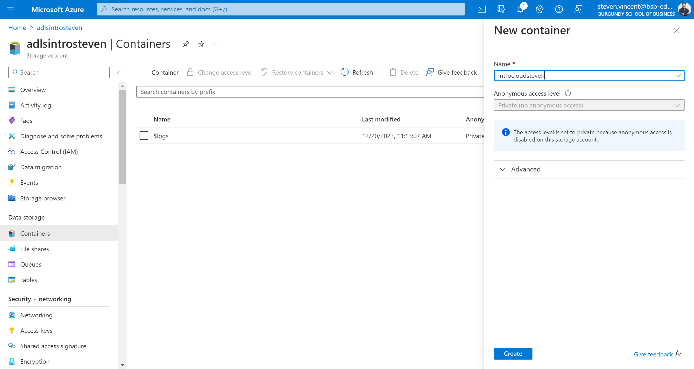

# Access Azure Data Lake to local with Python

In this section, we will create a datalake and copy data from another datalake.

## Create your datalake

First, you need to connect to your Azure account:

[:octicons-eye-24: | Access your azure account](https://portal.azure.com/#home){:target="_blank" .md-button .md-button--primary }

From the Azure homepage, search for **Storage accounts<Create** and fill in the following information:
Basics:

- Subscription: you should select your school subscription
- Resource group: create a new resource group where your account storage will be stored
- Storage account name: select the name you want for your Data lake
- Region: select the region of your workspace, select **West Europe**
- Performance: **Standard**
- Redundancy: **Locally-redundant storage (LRS)**

Advanced:

- Hierarchical Namespace: **Enable hierarchical namespace**

Now review & create your account storage. Wait several minutes and you can access your Data lake!

## Create a container

Open your Data Lake newly created and go to Container under Data Storage and Create a new container that you can name the way you want.

## Access to another data lake and copy data

We will now try to connect to a Data Lake from your computer, read the data and export it to your Data Lake, we will be able to transfer millions of rows easily.

