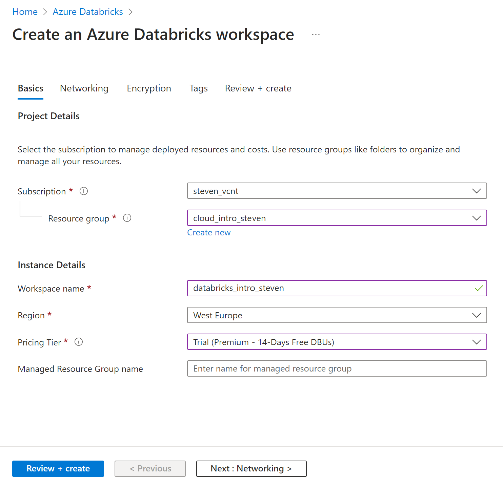
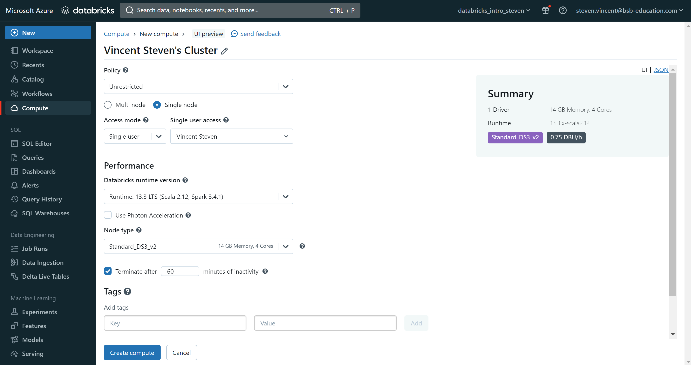
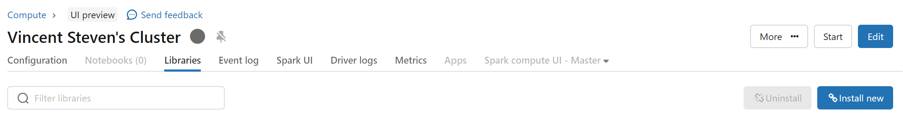
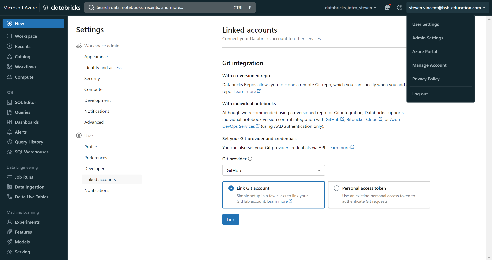
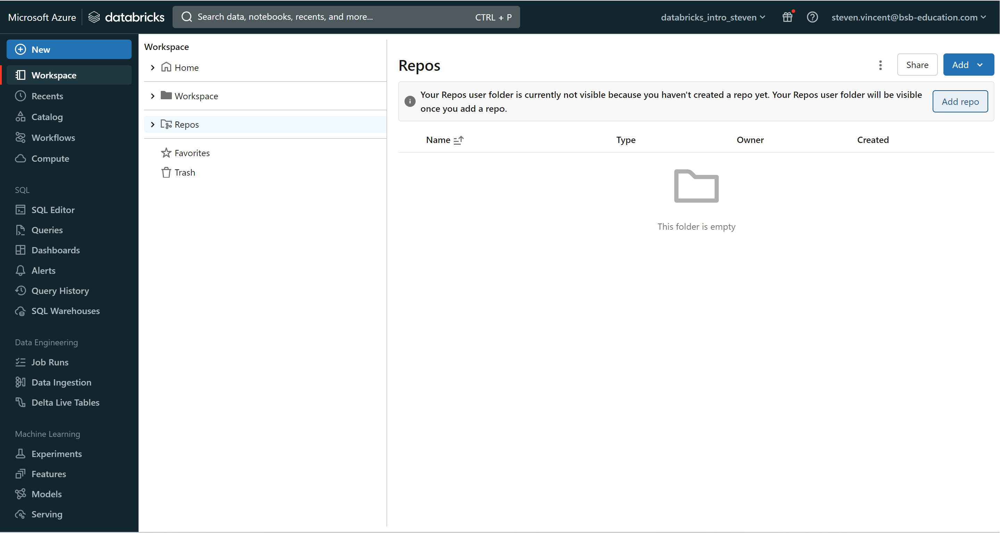
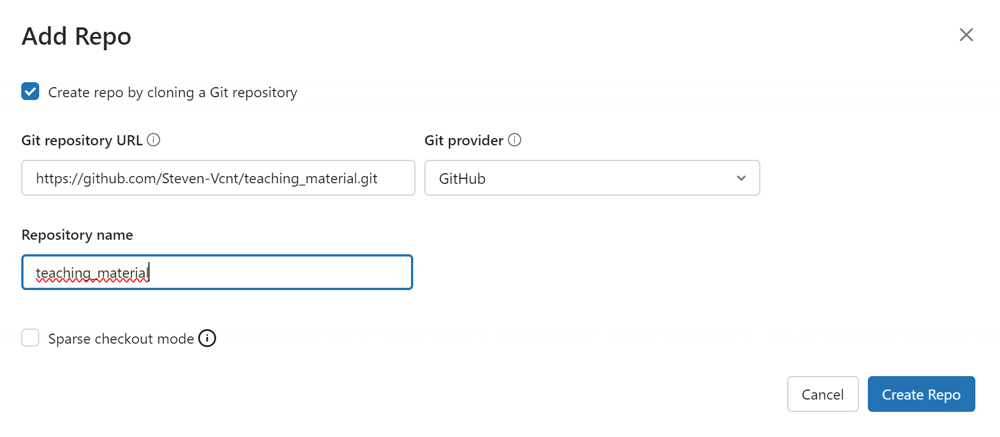
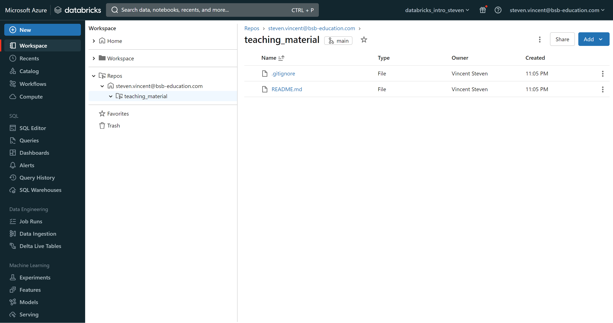

# Setup a Databricks workspace

In this section, we will create a Databricks workspace to work with datalake and Pyspark.

## Create a Databricks workspace

First, you need to connect to your Azure account:

[:octicons-eye-24: | Access your azure account](https://portal.azure.com/#home){:target="_blank" .md-button .md-button--primary }

From the Azure homepage, search for Azure Databricks in the search bar. Then click on Create they will ask you to fill in some information that is explained below:

- Subscription: you should select your school subscription
- Resource group: create a new resource group where your workspace will be stored
- Workspace name: select the name you want for your workspace
- Region: select the region of your workspace, select **West Europe**
- Pricing tier: select the pricing plan you want, select **Trial**



Once fields are filled in, you can review & create your Databricks Workspace. Wait several minutes and now you can access your Databricks Workspace!

## Create and configure a Databricks cluster

A Databricks cluster is the compute part that lets you run code on Databricks. Depending on the provider, you are using virtual machines with a specific configuration to run on.

Go to the compute section and **Create compute** with the following configuration:

- single node
- unselect *use Photon Acceleration*
- node type as Standard_DS3_V2
- terminate after **60 minutes** of inactivity



Your cluster will start and will appear in the **compute>All-purpose compute** section. Click on your newly created cluster and then go to the **Libraries** section.

Click on **Install New**, select **Pypi** as the Library Source and enter the package you wish to install on the cluster in the **Package** section. You can select a specific version of your package with the following syntax *package==1.0.3*.



## Run your code on Databricks

Hence the environment setup, we can try to run some codes on a Databricks Jupyter notebook. Go to the section **Workspace>Workspace>Add>Notebook**.
We will use the same Python code example as the page [API basics](3.api_basics.md):

```python title="Import Python packages"
import requests
import pandas as pd
import json
pd.set_option('display.max_columns', 500)
# Set your Alpha Vantage API Key
AV_API_Key='YOURAPIKEY'
```

```python title="Search a ticker by keyword"
search_keyword='meta'
url = 'https://www.alphavantage.co/query?function=SYMBOL_SEARCH&keywords={searchKeyword}&apikey={apiKey}'.format(apiKey=AV_API_Key, searchKeyword=search_keyword)
r_search = requests.get(url)
js_search = r_search.json()
df_search=pd.DataFrame(js_search)
display(df_search)
```

Well done, you can now use Databricks to run Python code!

!!! Tip
    If you want to go further, you can check my blog post on how Web Scrape data with Databricks: [How to use Selenium package on Databricks](../../../blog/posts/selenium_chrome_chromedriver_databricks.md){:target="_blank"}.

## Clone a GitHub repository to Databricks

### Connect your GitHub account to your Databricks workspace

Click on your mail address top right, then User Settings>Linked Account. Change the git provider by GitHub and select Link Git account to link your GitHub account to your Databricks workspace.



### Clone your repository

Go to **Workspace>Repos>Add repo**



Then they will ask you for the following information before creating the repository:

- Git repository URL: URL available on GitHub under **Code>Https link of your repository**.
- Git provider: GitHub
- Repository name: Name of the Databricks repository

!!! tip
    Repository information (Git provider and repository) will be generated automatically from the link pasted in the Git repository URL



To check if your repository is well cloned, you should find in the repository the README file initially created under **Repos>YourMailAddress>YourRepositoryName** or any file available in your repository.



---
