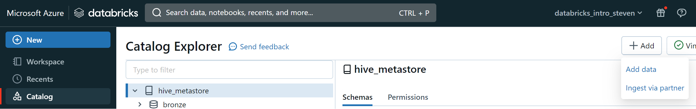
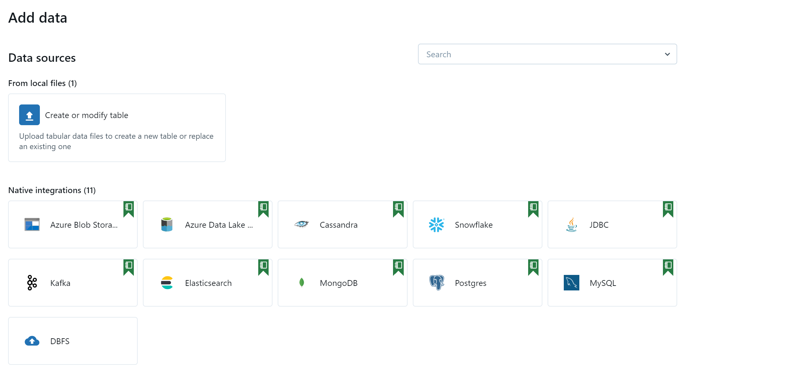
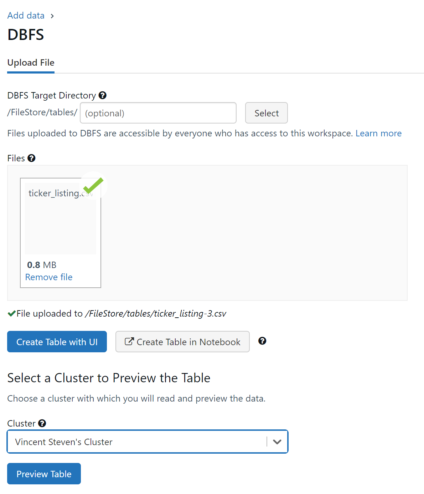
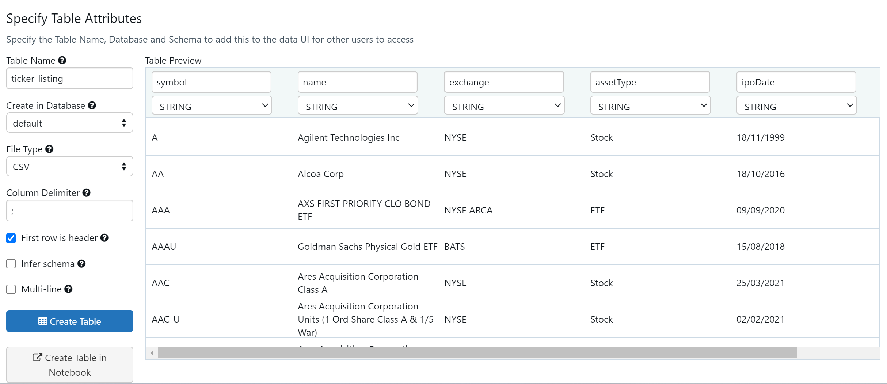

# [Databricks] Create a delta table

For this guide, you will need to download a list of tickers available below:

[:octicons-desktop-download-24: | Download the ticker listing](../../../assets/files/ticker_listing.csv){:download='ticker_listing.csv' :target="_blank" .md-button .md-button--primary }

## Import data through DBFS and create a delta table

Hence installed, we can now import the CSV file within Databricks. Go to **Catalog>Add>Add data**:



Next, **Select DBFS as Native integration**:



Next, **Select your file>Select the mode of table creation** then you will find a preview of your table that you can create directly or you can browse a delta table creation through a notebook:

{width="400"}

!!! Warning
    If you select the option **Create Table with UI**, you will need to start a cluster to have a compute. Without compute you will have to use the notebook way to create the table.

You should specify the following table attributes:

- Table Name: ticker_listing
- Database: 'default'
- File Type: CSV
- Column Delimiter: ';'
- Check 'First row is header'



## Create a delta table from a pandas DataFrame

Before we start, create a new notebook within your Databricks Workspace. It should be inside **Repos>YourMailAddress>NameofYourReposiroty**.

### Select a delta table with SQL & PySpark

```sql title="Select & analyse your delta table newly created"
%sql
SELECT 
    symbol, name, exchange, assetType, ipoDate, delistingDate
FROM
    bronze.ticker_listing
WHERE 
    symbol IN ('AAPL', 'GOOGL', 'AMZN', 'MSFT')
```

```sql title="Store the result of your SQL query within a pyspark variable"
sp_ticker_list = spark.sql('''
            SELECT DISTINCT 
              symbol 
            FROM 
              bronze.ticker_listing
            WHERE 
              symbol IN ('AAPL', 'GOOGL', 'AMZN', 'MSFT')
              ''')
```

### Make an API call with Python to fetch data

```python title="Import Python packages"
import requests
import pandas as pd
import json
import os
import time
from datetime import datetime
pd.set_option('display.max_columns', 500)
# Set your Alpha Vantage API Key
AV_API_Key=dbutils.secrets.get(scope = "secret_keys", key = "AV_API_Key")
```

```python title="Extract data from ticker through AlphaVantageAPI"
# Convert PySpark DataFrame to a Pandas DataFrame and store the value in a list
ticker_list = sp_ticker_list.toPandas().values.tolist()
# Initialize empty DataFrame
ticker_time_series=pd.DataFrame()
ticker_metadata=pd.DataFrame()
# Loop on the ticker list
for ticker in ticker_list :
    r_stock = requests.get('https://www.alphavantage.co/query?function=TIME_SERIES_DAILY&symbol={ticker}&apikey={apiKey}'.format(apiKey=AV_API_Key, ticker=ticker[0]))
    js_stock = r_stock.json()
    try:
        # Ticker time series to DataFrame
        df_time_series=pd.DataFrame(js_stock['Time Series (Daily)'])
        df_time_series['Ticker'] = ticker[0]
        ticker_time_series = pd.concat([ticker_time_series, df_time_series])
        # Ticker metadata to DataFrame
        df_metadata=pd.json_normalize(js_stock['Meta Data'])
        df_metadata['Ticker'] = ticker[0]
        df_metadata['Status'] = 'active'
        df_metadata['Date'] = datetime.now()
        time.sleep(1)
    except:
        df_metadata = pd.DataFrame({"Ticker" : [ticker[0]], "Status": ["inactive"] , "Date":[ datetime.now()]})
    ticker_metadata = pd.concat([ticker_metadata, df_metadata])
display(ticker_metadata.head())
```

```python title="Long to wide"
ticker_time_series=ticker_time_series.reset_index().rename({'index':'Value_type'}, axis=1)
lg_ticker_ts = ticker_time_series.melt(id_vars=['Ticker','Value_type'])
display(lg_ticker_ts.head())
```

### Create a temporary table to query your DataFrame with SQL

```python title="Pandas to spark DataFrame and create a temporary view"
sp_ticker_ts=spark.createDataFrame(lg_ticker_ts)
sp_ticker_ts.distinct().createOrReplaceTempView('sp_ticker_ts')
```

```sql title="Query the temp view"
%sql
SELECT 
    * 
FROM
    sp_ticker_ts
```

### Create a new Schema and create a delta table with Spark

```sql title="Create medaillon schema"
%sql
CREATE SCHEMA IF NOT EXISTS bronze;
CREATE SCHEMA IF NOT EXISTS silver;
CREATE SCHEMA IF NOT EXISTS gold
```

```python title="Write a delta file and create a table from the file location"
# ticker time series value
sp_ticker_ts=spark.createDataFrame(lg_ticker_ts)
sp_ticker_ts.distinct().createOrReplaceTempView('temp_sp_ticker_ts')
spark.sql('''
CREATE TABLE IF NOT EXISTS bronze.ticker_value
USING DELTA
AS SELECT * FROM temp_sp_ticker_ts
          ''')
# ticker metadata
ticker_metadata = ticker_metadata.rename(columns={"1. Information": "Information", "2. Symbol": "Symbol", "3. Last Refreshed": "Last_Refreshed", "4. Output Size" : "Output_Size", "5. Time Zone" : "Time_Zone"})
sp_ticker_metadata = spark.createDataFrame(ticker_metadata)
sp_ticker_metadata.distinct().createOrReplaceTempView('temp_sp_ticker_metadata')
spark.sql('''
CREATE TABLE IF NOT EXISTS bronze.ticker_metadata
USING DELTA
AS SELECT * FROM temp_sp_ticker_metadata
''')
```

---
