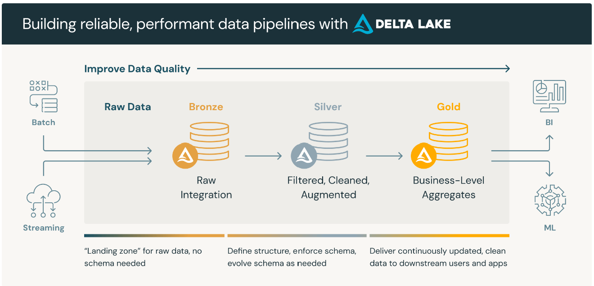
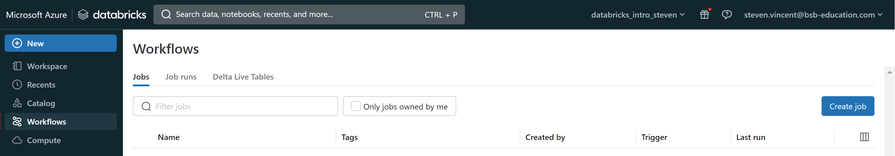
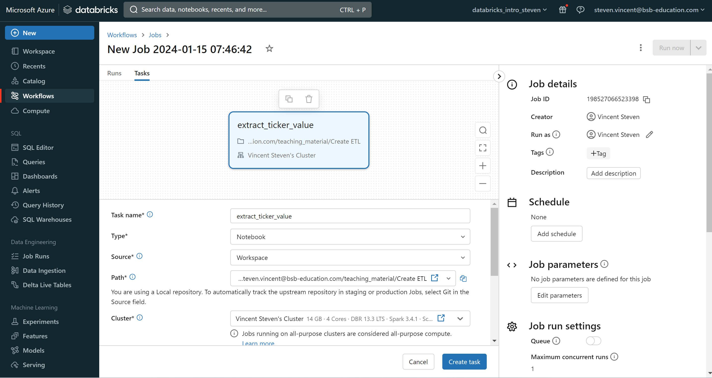
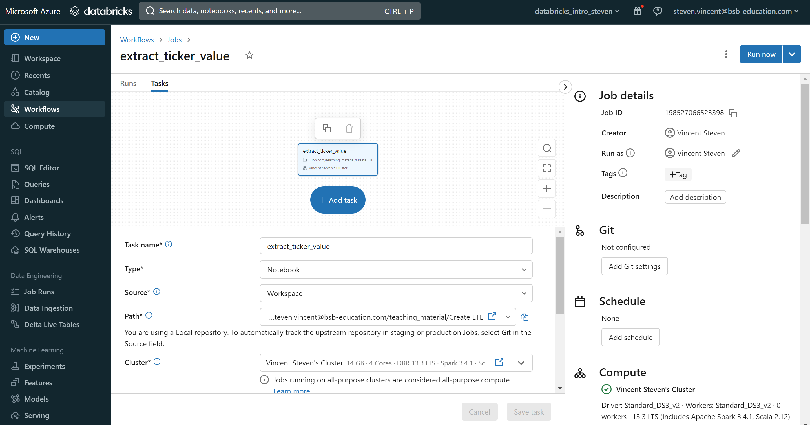
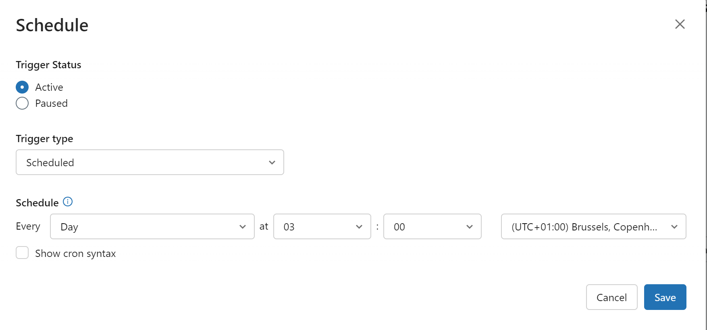
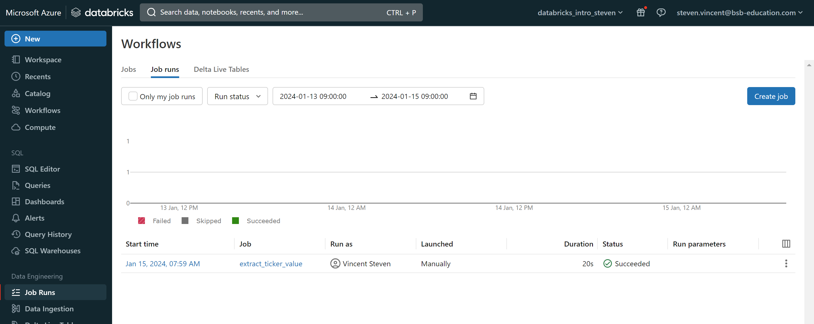

# [Databricks] Create an ETL job

To create our ETL job, we will follow the Databricks [Medaillon Schema](https://www.databricks.com/glossary/medallion-architecture){:target="_blank"}.



## Setup the ETL Bronze layer

```sql title="Query the ticker to fetch"
sp_ticker_list = spark.sql('''
            SELECT DISTINCT 
              tl.symbol 
            FROM 
              default.ticker_listing tl
            LEFT JOIN bronze.ticker_metadata tm
                ON tl.symbol=tm.Ticker
            WHERE 
              tm.Ticker IS NULL
            LIMIT 10
              ''')
```

```python title="Import Package"
import requests
import pandas as pd
import json
import os
from datetime import datetime
pd.set_option('display.max_columns', 500)
AV_API_Key = 'YourAPIKey'
```

```python title="Fetch the ticker with the AlphaVanta API"
# Convert PySpark DataFrame to a Pandas DataFrame and store the value in a list
ticker_list = sp_ticker_list.toPandas().values.tolist()
# Initialize empty DataFrame
ticker_time_series=pd.DataFrame()
ticker_metadata=pd.DataFrame()
# Loop on the ticker list
for ticker in ticker_list :
    r_stock = requests.get('https://www.alphavantage.co/query?function=TIME_SERIES_DAILY&outputsize=full&symbol={ticker}&apikey={apiKey}'.format(apiKey=AV_API_Key, ticker=ticker[0]))
    js_stock = r_stock.json()
    try:
        # Ticker time series to DataFrame
        df_time_series=pd.DataFrame(js_stock['Time Series (Daily)'])
        df_time_series['Ticker'] = ticker[0]
        ticker_time_series = pd.concat([ticker_time_series, df_time_series])
        # Ticker metadata to DataFrame
        df_metadata=pd.json_normalize(js_stock['Meta Data'])
        df_metadata['Ticker'] = ticker[0]
        df_metadata['Status'] = 'active'
        df_metadata['Date'] = datetime.now()
    except:
        df_metadata = pd.DataFrame({"Ticker" : [ticker[0]], "Status": ["inactive"] , "Date": [datetime.now()], '1. Information':[None], '2. Symbol': [None], '3. Last_Refreshed' : [None], '4. Output_Size' : [None], '5. Time_Zone' : [None]})
    ticker_metadata = pd.concat([ticker_metadata, df_metadata])
display(ticker_metadata.head())
```

```python title="Upsert ticker value data "
try:
  ticker_time_series=ticker_time_series.reset_index().rename({'index':'Value_type'}, axis=1)
  lg_ticker_ts = ticker_time_series.melt(id_vars=['Ticker','Value_type'])
  display(lg_ticker_ts.head())
  sp_ticker_ts=spark.createDataFrame(lg_ticker_ts)
  sp_ticker_ts.distinct().createOrReplaceTempView('sp_ticker_temp')
  spark.sql(''' 
            MERGE INTO 
              bronze.ticker_value 
            USING  sp_ticker_temp 
              ON bronze.ticker_value.Ticker = sp_ticker_temp.Ticker
            WHEN MATCHED THEN
              UPDATE SET  *
            WHEN NOT MATCHED THEN
              INSERT  *
            ''')
except:
  pass

```

```python title="Create temp view"
ticker_metadata = ticker_metadata.rename(columns={"1. Information": "Information", "2. Symbol": "Symbol", "3. Last Refreshed": "Last_Refreshed", "4. Output Size" : "Output_Size", "5. Time Zone" : "Time_Zone"})
sp_ticker_metadata=spark.createDataFrame(ticker_metadata)
sp_ticker_metadata.distinct().createOrReplaceTempView('ticker_metadata_temp')
```

```sql title="Upsert Ticker metadata delta table"
%sql MERGE INTO bronze.ticker_metadata USING ticker_metadata_temp ON bronze.ticker_metadata.Ticker = ticker_metadata_temp.Ticker
WHEN MATCHED THEN
UPDATE
SET
  *
  WHEN NOT MATCHED THEN
INSERT
  *
```

## Set up the schedule with Databricks Jobs

We will now schedule a daily job to extract ticker 10 by 10 every day.
Go to Databricks **Workflows>Create Job**



Add the following parameters to your task and then create a task:

- Task name: extract_ticker_value
- Type: Notebook
- Source: Workspace
- Path: Your notebook path
- Cluster: Your active cluster



Lastly, modify your job to add a scheduler:



Add the following schedule:

- Trigger Status: Active
- Trigger type: Scheduled
- Schedule: Every Day at 3 AM UTC +01:00



Well done, you can run your job with the button **Run now** to verify if everything works!

You should see your run as succeeded in the **Job Runs** section:



## Setup the ETL Silver layer

### Ticker Value Table Silver Layer

If you try to print the Ticker Value table, you will see that the column Value_Type is stacked. We will use a [PIVOT](https://docs.databricks.com/en/sql/language-manual/sql-ref-syntax-qry-select-pivot.html){:target="_blank"} function to transform the dataset from Long to Wide.

#### Create Silver Ticker Value Delta Table  

```python title="Pivot ticker value & change data type and create delta table"
%python
sp_silver_ticker_value = spark.sql('''
 SELECT DISTINCT
    tv.Ticker, CAST(variable as DATE) as stock_date, Open, Close, High, Low, Volume 
FROM
  bronze.ticker_value tv
PIVOT (
  MAX(CAST(value AS DECIMAL(20,2)))
  FOR Value_Type IN ('1. open' AS Open, '4. close' AS Close, '2. high' as High, '3. low' as Low, '5. volume' as Volume)
)
LEFT JOIN (SELECT MIN(CAST(variable AS DATE)) AS min_variable, Ticker FROM bronze.ticker_value WHERE value IS NOT NULL GROUP BY Ticker) tv1
  ON tv.Ticker = tv1.Ticker --AND tv.variable = tv1.min_variable
WHERE 
    CAST(variable as DATE) > CAST(tv1.min_variable AS DATE) 
'''
)
sp_silver_ticker_value.distinct().write.mode("Overwrite").option("OverwriteSchema", "true").format("delta").save("/FileStore/silver/s_ticker_value") 
spark.sql("CREATE TABLE IF NOT EXISTS silver.s_ticker_value USING DELTA LOCATION '/FileStore/silver/s_ticker_value'")
```

#### Update/Merge Silver Ticker Value Delta Table

```sql title="Pivot ticker value & change data type"
CREATE OR REPLACE TEMPORARY VIEW ticker_value_update AS
SELECT 
  tv.Ticker, CAST(tv.variable as DATE) as stock_date, Open, Close, High, Low, Volume
FROM 
  bronze.ticker_value tv
PIVOT (
  MAX(CAST(tv.value AS DECIMAL(20,2)))
  FOR Value_Type IN ('1. open' AS Open, '4. close' AS Close, '2. high' as High, '3. low' as Low, '5. volume' as Volume)
)
LEFT JOIN (SELECT MIN(CAST(variable AS DATE)) AS min_variable, Ticker 
          FROM 
            bronze.ticker_value 
          WHERE 
            value IS NOT NULL GROUP BY Ticker) tv1
  ON tv.Ticker = tv1.Ticker
WHERE 
  CAST(variable as DATE) > CAST(tv1.min_variable AS DATE) 

```

```sql title="Upsert Ticker value delta table"
MERGE INTO silver.s_ticker_value
USING ticker_value_update
ON silver.s_ticker_value.Ticker=ticker_value_update.Ticker
and silver.s_ticker_value.stock_date = ticker_value_update.stock_date
WHEN MATCHED THEN
UPDATE SET *
WHEN NOT MATCHED THEN INSERT *
```

### Ticker Metadata Table Silver Layer

**Exercise**:

From the code of Ticker Value silver Layer, you will need to create the silver layer of Ticker Metadata.

**Instructions**:

- Use Python/SQL to create a new delta table
    - Use the bronze table ticker metadata and merge the table default ticker listing
    - Select the columns tm.*, tl.name, tl.exchange, tl.assetType
    - Dump the file to the folder silver with the name s_ticker_metadata
    - Create a silver table s_ticker_metadata
- Use only SQL to upsert merge the table
    - Take the query used in the first part to create a TEMPORARY VIEW
    - Create a Merge INTO query to merge the TEMPORARY VIEW and table s_ticker_metadata
- Comment out the Python Code
- Add a new task in your ETL Job  

## Setup the ETL Gold layer

### Create Gold Ticker Value Delta Table

```python title="Create Table & Upsert Ticker metadata delta table"
%python
sp_gold_ticker_value = spark.sql('''
SELECT 
  tm.name, tv.stock_date, tv.Open, tv.Close, tv.High, tv.Low, tv.Volume, (tv.Close - tv.Open)/tv.Open * 100 AS intra_day_evolution
  ,AVG(tv.Close) 
  OVER (
       ORDER BY tm.name, tv.stock_date
       ROWS BETWEEN 1 PRECEDING AND CURRENT ROW
       ) AS 1D_Moving_Average
  , (tv.Close - 1D_Moving_Average)/1D_Moving_Average * 100 AS day_evolution
  ,AVG(tv.Close) 
    OVER (
        ORDER BY tm.name, tv.stock_date
        ROWS BETWEEN 5 PRECEDING AND CURRENT ROW
        ) AS 5D_Moving_Average
  , (tv.Close - 5D_Moving_Average)/5D_Moving_Average * 100 AS week_evolution
  ,AVG(tv.Close) 
    OVER (
        ORDER BY tm.name, tv.stock_date
        ROWS BETWEEN 30 PRECEDING AND CURRENT ROW
        ) AS 1M_Moving_Average
        , (tv.Close - 1M_Moving_Average)/1M_Moving_Average * 100 AS month_evolution
  ,AVG(tv.Close) 
    OVER (
        ORDER BY tm.name, tv.stock_date
        ROWS BETWEEN 180 PRECEDING AND CURRENT ROW
        ) AS 6M_Moving_Average
        , (tv.Close - 6M_Moving_Average)/6M_Moving_Average * 100 AS semester_evolution
    ,AVG(tv.Close)
    OVER (
        ORDER BY tm.name, tv.stock_date
        ROWS BETWEEN 360 PRECEDING AND CURRENT ROW
        ) AS 1Y_Moving_Average
    , (tv.Close - 1Y_Moving_Average)/1Y_Moving_Average * 100 AS year_evolution
FROM 
  silver.s_ticker_value tv
LEFT JOIN silver.s_ticker_metadata tm
  ON tm.Ticker = tv.Ticker
'''
)
sp_gold_ticker_value.distinct().write.mode("Overwrite").option("OverwriteSchema", "true").format("delta").save("/FileStore/gold/g_ticker_value") 
spark.sql("CREATE TABLE IF NOT EXISTS gold.g_ticker_value USING DELTA LOCATION '/FileStore/gold/g_ticker_value'")
```

### Update/Merge Gold Ticker Value Delta Table

```sql title="Create the Gold table gold.g_ticker_value "
CREATE OR REPLACE TEMPORARY VIEW gold_ticker_value_update AS
SELECT DISTINCT
  tm.name, tv.stock_date, tv.Open, tv.Close, tv.High, tv.Low, tv.Volume, (tv.Close - tv.Open)/tv.Open * 100 AS intra_day_evolution
  ,AVG(tv.Close) 
  OVER (
       ORDER BY tm.name, tv.stock_date
       ROWS BETWEEN 1 PRECEDING AND CURRENT ROW
       ) AS 1D_Moving_Average
  , (tv.Close - 1D_Moving_Average)/1D_Moving_Average * 100 AS day_evolution
  ,AVG(tv.Close) 
    OVER (
        ORDER BY tm.name, tv.stock_date
        ROWS BETWEEN 5 PRECEDING AND CURRENT ROW
        ) AS 5D_Moving_Average
  , (tv.Close - 5D_Moving_Average)/5D_Moving_Average * 100 AS week_evolution
  ,AVG(tv.Close) 
    OVER (
        ORDER BY tm.name, tv.stock_date
        ROWS BETWEEN 30 PRECEDING AND CURRENT ROW
        ) AS 1M_Moving_Average
        , (tv.Close - 1M_Moving_Average)/1M_Moving_Average * 100 AS month_evolution
  ,AVG(tv.Close) 
    OVER (
        ORDER BY tm.name, tv.stock_date
        ROWS BETWEEN 180 PRECEDING AND CURRENT ROW
        ) AS 6M_Moving_Average
        , (tv.Close - 6M_Moving_Average)/6M_Moving_Average * 100 AS semester_evolution
    ,AVG(tv.Close)
    OVER (
        ORDER BY tm.name, tv.stock_date
        ROWS BETWEEN 360 PRECEDING AND CURRENT ROW
        ) AS 1Y_Moving_Average
    , (tv.Close - 1Y_Moving_Average)/1Y_Moving_Average * 100 AS year_evolution

FROM 
  silver.s_ticker_value tv
LEFT JOIN silver.s_ticker_metadata tm
  ON tm.Ticker = tv.Ticker

```

```sql title="Upsert Ticker metadata delta table"
MERGE INTO gold.g_ticker_value
USING gold_ticker_value_update
ON gold.g_ticker_value.name=gold_ticker_value_update.name
and gold.g_ticker_value.stock_date = gold_ticker_value_update.stock_date
WHEN MATCHED THEN
UPDATE SET *
WHEN NOT MATCHED THEN INSERT *

```

---
