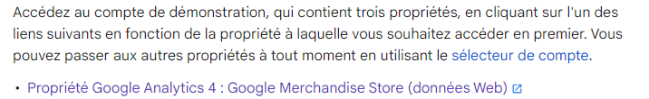
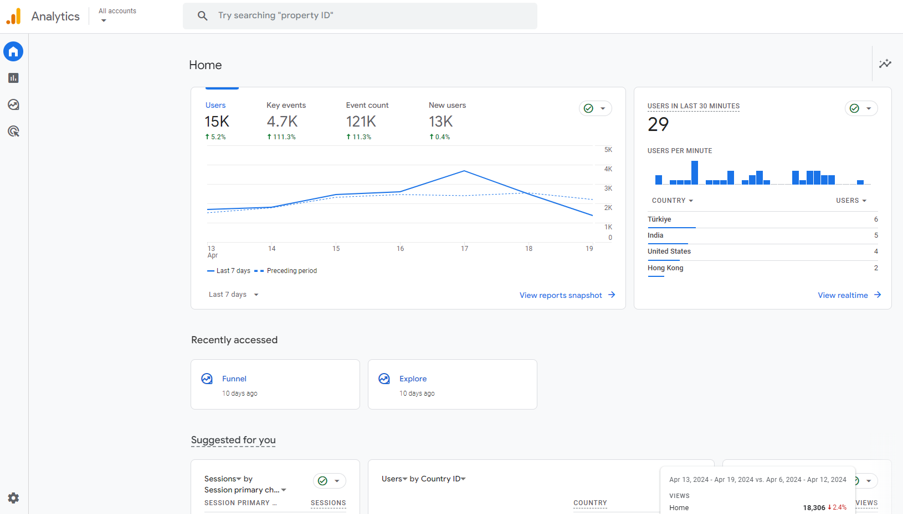

# Compte de démonstration Google Analytics

Afin de vous apprivoiser avec la plateforme Google Analytics, vous pouvez accèder au [guide de configuration de la vue Google Analytics](https://support.google.com/analytics/answer/6367342?hl=fr&sjid=11882257157492328681-EU#access&zippy=%2Cin-this-article%2Cau-sommaire-de-cet-article){:target="_blank"} où vous retrouverez l'ensemble des informations nécessaires à son utilisation.

Vous pouvez accéder directement à la propriété Google Merchandise Store afin d'explorer Google Analytics directement depuis votre compte Google:

[:octicons-eye-24: | Accéder à la propriété Google Merchandise Store](https://analytics.google.com/analytics/web/demoAccount?appstate=/p213025502){:target="_blank" .md-button .md-button--primary }

!!! Note
    Si vous accédez à la page support Google Analytics, sélectionnez le lien **Propriété Google Analytics 4 : Google Merchandise Store (données Web)** affiché ci-dessous depuis la page Web:
    { width="600" }

Si vous avez réussi à accéder à la propriété Google Analytics Google Merchandise Store, vous devriez accéder à la page Web suivante:

**Vous pouvez désormais explorer l'ensemble des rapports Google Analytics !**

---
