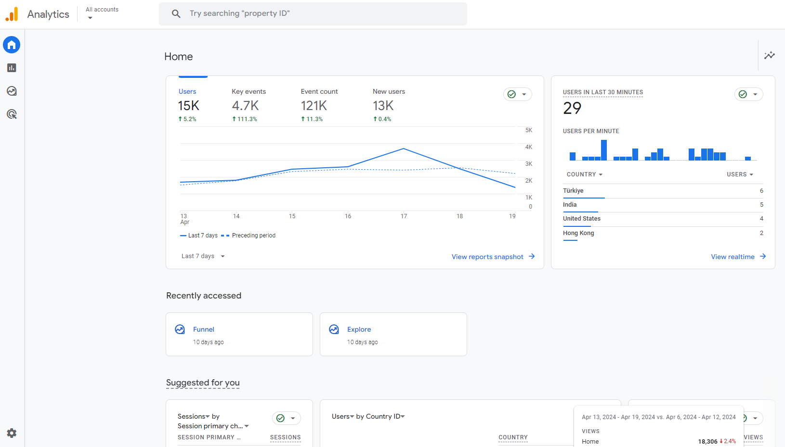

# Configuration

## Configure your Google Analytics demo account

Get started with Google Analytics by reviewing the [Google view configuration guide Analytics](https://support.google.com/analytics/answer/6367342?hl=en&sjid=9082990024081697183-EU#access&zippy=%2Cin-this-article%2Cau-sommaire-de-cet-article){:target= "_blank"} for detailed instructions.

On the page, select the **Google Analytics Property 4: Google Merchandise Store (web data)** link shown below from the web page:
    { width="600" }

Afterwards you can go directly to the Google Merchandise Store property to explore Google Analytics directly from your Google account:

[:octicons-eye-24: | Go to Google Merchandise Store property](https://analytics.google.com/analytics/web/?utm_source=demoaccount&utm_medium=demoaccount&utm_campaign=demoaccount#/p213025502/reports/intelligenthome){:target="_blank" .md-button .md-button--primary }

If you have successfully accessed the Google Analytics Google Merchandise Store property, you should land on the following web page:

**You can now explore all Google Analytics reports!**

## Configure Google Big Query

BigQuery enables you to use SQL to browse your Google Analytics data. Open data from Google Analytics will be used in this workshop.

[:octicons-eye-24: | Go to BigQuery sandbox](https://cloud.google.com/bigquery/docs/sandbox){:target="_blank" .md-button .md-button--primary }

---
