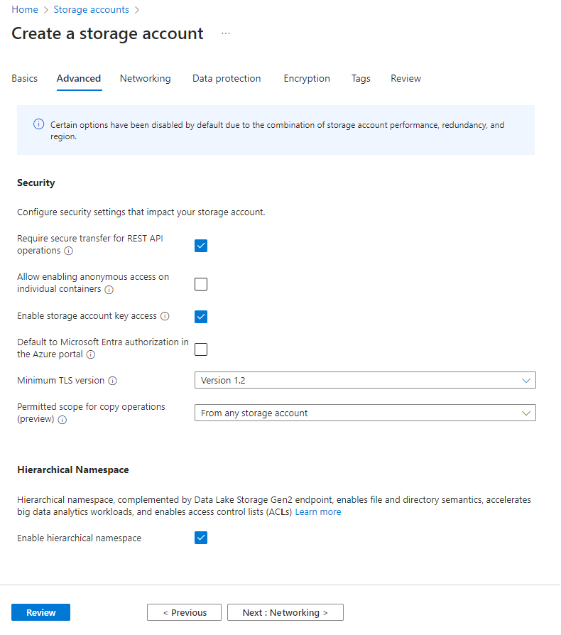

# Access Azure Data Lake to local with Python

In this section, we will create a datalake and copy data from another datalake.

## Create your datalake

First, you need to connect to your Azure account:

[:octicons-eye-24: | Access your azure account](https://portal.azure.com/#home){:target="_blank" .md-button .md-button--primary }

From the Azure homepage, search for **Storage accounts<Create** and fill in the following information:
Basics:

- Subscription: you should select your school subscription
- Resource group: create a new resource group where your account storage will be stored
- Storage account name: select the name you want for your Data lake
- Region: select the region of your workspace, select **West Europe**
- Performance: **Standard**
- Redundancy: **Locally-redundant storage (LRS)**

<!-- more -->


Advanced:

- Hierarchical Namespace: **Enable hierarchical namespace**



Now review & create your account storage. Wait several minutes and you can access your Data lake!

## Create a container

Open your Data Lake newly created and go to Container under Data Storage and Create a new container that you can name the way you want.


## Create a Data Azure Data Lake Shared Access Signature

A [shared access signature (SAS)](https://learn.microsoft.com/en-us/azure/storage/common/storage-sas-overview){:target="_blank"} enables you to access resources in your storage account.

To create SAS key from your account storage, go to your account storage

## Access to another data lake and copy data

We will now try to connect to a Data Lake from your computer, read the data and export it to your Data Lake, we will be able to transfer millions of rows easily.

```python title="Definition to access csv from a datalake"
def adls_read_file(adls, container, SASKey, csvpath, separator):
    '''
    Read a flat file stored in an Azure Data Lake Storage. You need the following arguments to make it work:
    - adls : Azure Data Lake Storage name
    - container : Container name of your Data Lake Storage
    - SASKey : Azure Data Lake Storage Shared Acess Signature key
    - csvpath : Path of your file
    - separator : Separator of your flat file
    '''
    spark.conf.set("fs.azure.account.auth.type.{adls}.dfs.core.windows.net".format(adls=adls), "SAS")
    spark.conf.set("fs.azure.sas.token.provider.type.{adls}.dfs.core.windows.net".format(adls=adls), "org.apache.hadoop.fs.azurebfs.sas.FixedSASTokenProvider")
    spark.conf.set("fs.azure.sas.fixed.token.{adls}.dfs.core.windows.net".format(adls=adls), str(SASKey))
    sp_dvf_file=spark.read.csv('abfs://{container}@{adls}.dfs.core.windows.net/{csvpath}'.format(adls=adls, container=container, csvpath=csvpath),sep=separator, header=True)
    return sp_dvf_file
    
```
