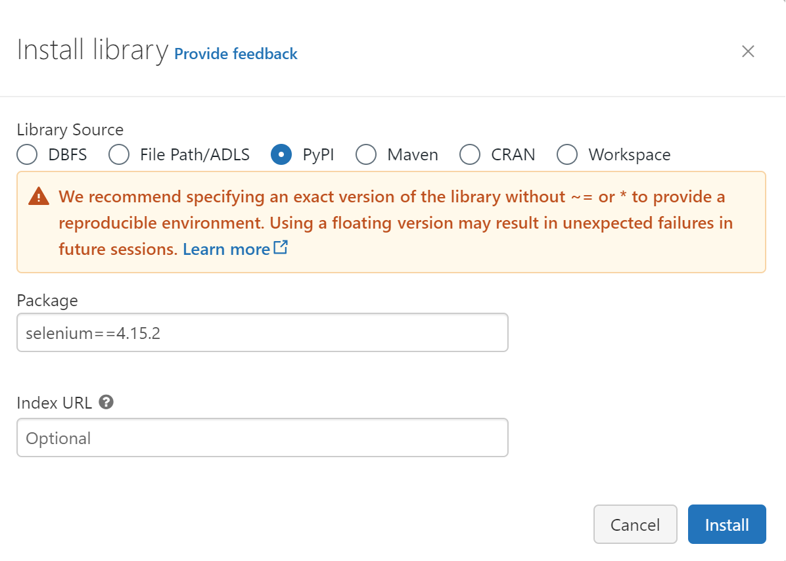

# How to use Selenium package on Databricks

## Introduction

In this guide, we will configure a Web scraper on Databricks with Selenium. A Web scraper aims to extract data from websites in an automated way. With Databricks, you can store huge volumes of data and set up a daily job to fetch the data.

[Databricks](https://www.databricks.com/) is a data platform. It enables you to build Machine Learning models and Data Engineering jobs.

[Selenium's](https://www.selenium.dev/) purpose is to automate Web browser interactions. its integration with Python enables you to scrape websites.

<!-- more -->

## Install Selenium Python Package

Hence you have created your cluster and accessed the cluster's configuration page. Click on Libraries, and select the "install new" button.

{ width="1000"}

It will open an install library window with several options. Select PyPi in Library Source and add "selenium==4.15.2" as a package name.

{ width="500"}

!!! note
    You can also add a Selenium package without a specific version but it is not recommended. You need to specify the package without a version, for example, "selenium".

## Download Chrome on your Databricks Workspace

Now that you have Selenium, we will need to install Google Chrome in your workspace.
!!! warning
    You will need to execute the bash script whenever you restart/create a cluster. The installation is made on the cluster and not Databricks itself.

You can execute the following bash scripts in a Databricks notebook:

```sh
%sh
sudo apt-get update
wget http://ftp.de.debian.org/debian/pool/main/f/fonts-liberation/fonts-liberation_1.07.4-11_all.deb
sudo dpkg -i fonts-liberation_1.07.4-11_all.deb
wget http://ftp.de.debian.org/debian/pool/main/m/mesa/libgbm1_20.3.5-1_amd64.deb
sudo dpkg -i libgbm1_20.3.5-1_amd64.deb
wget http://ftp.de.debian.org/debian/pool/main/n/nspr/libnspr4_4.29-1_amd64.deb
sudo dpkg -i libnspr4_4.29-1_amd64.deb
wget http://ftp.de.debian.org/debian/pool/main/n/nss/libnss3_3.61-1+deb11u1_amd64.deb
sudo dpkg -i libnss3_3.61-1+deb11u1_amd64.deb
sudo apt-get -f install -y
wget https://dl.google.com/linux/direct/google-chrome-stable_current_amd64.deb
sudo dpkg -i google-chrome-stable_current_amd64.deb
sudo apt-get install -f -y
```

!!! note
    %sh [magic command](https://docs.databricks.com/en/notebooks/notebooks-code.html#mix-languages) enables you to execute shell command in a Databricks notebook.

## Create a Python function to setup your driver

Now, Google Chrome & Google Chromedriver are installed. The next step is to configure our selenium driver to be able to browse and fetch (Web Scrape) data from a website. The function below enables you to create a selenium driver. It will be called to retrieve the HTML code of the webpage you want.

```python
#import selenium webdriver
from selenium import webdriver
from selenium.webdriver.chrome.service import Service

def jsDriver(url: str):
    '''
    Set up selenium webdriver to use Chrome through an headless browser.
    '''
    user_agent = '''Mozilla/5.0 (Windows NT 10.0; Win64; x64) AppleWebKit/537.36 (KHTML, like Gecko) Chrome/89.0.4389.114 Safari/537.36'''
    service = Service()
    options = webdriver.ChromeOptions()
    options.add_argument("--headless")
    options.add_argument("--no-sandbox")
    options.add_argument("--disable-dev-shm-usage")
    options.add_argument("start-maximized")
    options.add_experimental_option("excludeSwitches", ["enable-automation"])
    options.add_argument(f"user-agent={user_agent}")
    options.add_experimental_option("useAutomationExtension", False)
    jsDriver = webdriver.Chrome(service=service, options=options)
    jsDriver.get(url)
    return jsDriver
```

## Browse a website to fetch data

Now that we have defined our function and configured our cluster, we can now fetch data from the Website. We will extract a table with Google Quote historical data from [Nasdaq.com](https://www.nasdaq.com/market-activity/stocks/googl/historical). For the example, we will use the Python package pandas and the read_html() function.

```python
# URL to be browsed
url = 'https://www.nasdaq.com/market-activity/stocks/googl/historical'
# Open link through Selenium and retrieve HTML from url
nasdaqGoogle = jsDriver(url)
# Parse the html page and read the table into a DataFrame
quoteGoogle = pd.read_html(StringIO(nasdaqGoogle.page_source), attrs={"class": "historical-data__table"})
# Concat table if you read more than one table within the Webpage
quoteGoogle = pd.concat(quoteGoogle)
# Print the result
print(quoteGoogle.head())
```

## Conclusion

Now you can web scrape Website data from Databricks with few lines of code. From there you can set up a Databricks scheduled job to retrieve daily data from a website.

---
